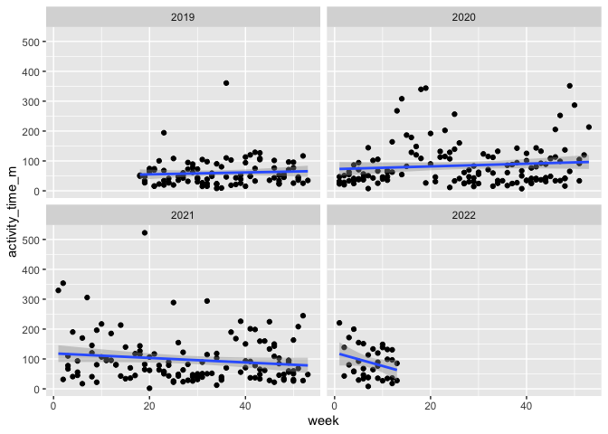
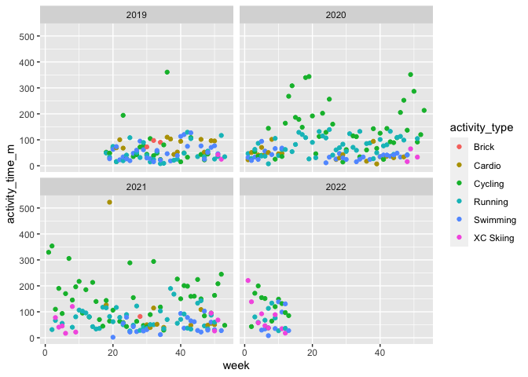

## Simple Training Load Metrics 

Got Garmin activity data and quick analysis of training time 


```r
data <- read.csv("Activities_to_2022_03_29.csv")
tibble(data)
```

```
## # A tibble: 808 × 44
##    Activity.Type  Date   Favorite Title    Distance Calories Time  Avg.HR Max.HR
##    <chr>          <chr>  <chr>    <chr>    <chr>    <chr>    <chr> <chr>  <chr> 
##  1 Pool Swimming  2022-… false    Pool Sw… 1,425    420      00:2… --     --    
##  2 Virtual Cycli… 2022-… false    Zwift -… 55.84    1,240    01:2… 153    172   
##  3 Running        2022-… false    Corman … 5.41     583      00:3… 164    187   
##  4 Cycling        2022-… false    Corman … 8.96     297      00:3… 118    151   
##  5 Pool Swimming  2022-… false    Pool Sw… 1,625    512      00:2… --     --    
##  6 Virtual Cycli… 2022-… false    Zwift -… 34.83    940      01:0… --     --    
##  7 Cross Country… 2022-… false    Corman … 3.38     152      00:1… 112    130   
##  8 Pool Swimming  2022-… false    Pool Sw… 5,000    1,499    01:4… --     --    
##  9 Virtual Cycli… 2022-… false    Zwift -… 24.76    521      00:5… --     --    
## 10 Pool Swimming  2022-… false    Pool Sw… 1,600    482      00:2… --     --    
## # … with 798 more rows, and 35 more variables: Aerobic.TE <chr>,
## #   Avg.Run.Cadence <chr>, Max.Run.Cadence <chr>, Avg.Pace <chr>,
## #   Best.Pace <chr>, Total.Ascent <chr>, Total.Descent <chr>,
## #   Avg.Stride.Length <dbl>, Avg.Vertical.Ratio <dbl>,
## #   Avg.Vertical.Oscillation <dbl>, Avg.Strokes <chr>, X.. <chr>,
## #   Normalized.Power...NP.. <chr>, Training.Stress.Score. <dbl>,
## #   Max.Avg.Power..20.min. <chr>, Avg.Power <chr>, Max.Power <chr>, …
```

## General date formatting


```r
data$Date <- ymd_hms(data$Date)

data$week <- week(data$Date)
data$year <- year(data$Date)

data$activity_time <- hms(data$Time)
data$activity_time <- as.duration(data$activity_time)
```

## Recoding activity types


```r
table(data$Activity.Type)
```

```
## 
##                       Cardio Cross Country Classic Skiing 
##                           42                           36 
##                      Cycling                       Hiking 
##                          126                            2 
##               Indoor Cycling               Indoor Running 
##                           41                            6 
##                   Multisport          Open Water Swimming 
##                            5                           39 
##                        Other                Pool Swimming 
##                            9                          108 
##                      Running            Strength Training 
##                          227                            1 
##            Treadmill Running              Virtual Cycling 
##                            8                          146 
##  Whitewater Kayaking/Rafting                         Yoga 
##                           11                            1
```

```r
data <- data %>%
	mutate(activity_type = case_when(
		Activity.Type == "Cardio" ~ "Cardio",
		Activity.Type == "Cross Country Classic Skiing" ~ "XC Skiing",
		Activity.Type == "Cycling" ~ "Cycling",
		Activity.Type == "Hiking" ~ "Cardio",
		Activity.Type == "Indoor Cycling" ~ "Cycling",
		Activity.Type == "Indoor Running" ~ "Running",
		Activity.Type == "Multisport" ~ "Brick",
		Activity.Type == "Open Water Swimming" ~ "Swimming",
		Activity.Type == "Other" ~ "Cardio",
		Activity.Type == "Pool Swimming" ~ "Swimming",
		Activity.Type == "Running" ~ "Running",
		Activity.Type == "Strength Training" ~ "Cardio",
		Activity.Type == "Treadmill Running" ~ "Running",
		Activity.Type == "Virtual Cycling" ~ "Cycling",
		Activity.Type == "Whitewater Kayaking/Rafting" ~ "Cardio",
		Activity.Type == "Yoga" ~ "Cardio",
		TRUE ~ "NOT STATED"
	))

table(data$activity_type)
```

```
## 
##     Brick    Cardio   Cycling   Running  Swimming XC Skiing 
##         5        66       313       241       147        36
```

## Grouping by week


```r
data_week <- data %>%
              group_by(year, week, activity_type) %>%
              summarize(
                activity_time = sum(activity_time)
              )
```

```
## `summarise()` has grouped output by 'year', 'week'. You can override using the `.groups` argument.
```

```r
data_week$activity_time_m <- data_week$activity_time/60

data_week <- data_week %>% 
              unite("year_week", year:week, remove = FALSE)
```

## Plot by week


```r
time_date <- ggplot(data_week, aes(x = week, y = activity_time_m)) + 
                      geom_point() + 
                      geom_smooth(method = "lm") +
                      facet_wrap(~ year)
plot(time_date)
```

```
## `geom_smooth()` using formula 'y ~ x'
```

<!-- -->

## Plot by week by activity type


```r
time_date_type <- ggplot(data_week, aes(x = week, y = activity_time_m, colour = activity_type)) + 
                      geom_point() + 
                      #geom_smooth(method = "lm") +
                      facet_wrap(~ year)
plot(time_date_type)
```

<!-- -->


